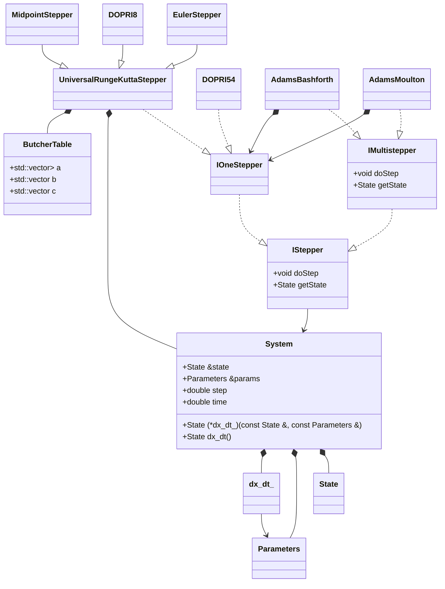

```mermaid
classDiagram
    class State
    class Parameters
    class dx_dt_

    dx_dt_ --> Parameters

 
    class System{
        +State &amp;state
        +Parameters &amp;params
        +double step
        +double time
        +State (*dx_dt_)(const State &, const Parameters &)
        +State dx_dt()
    }

    System *-- State
    System *-- Parameters
    System *-- dx_dt_

    class IStepper{
        +void doStep
        +State getState
    }

    IStepper --> System

    UniversalRungeKuttaStepper ..|> IOneStepper
    UniversalRungeKuttaStepper *-- System
    UniversalRungeKuttaStepper *-- ButcherTable

    class ButcherTable{
        +std::vector<std::vector<double>> a
        +std::vector<double> b
        +std::vector<double> c
    }

    EulerStepper --|> UniversalRungeKuttaStepper
    DOPRI8 --|> UniversalRungeKuttaStepper
    MidpointStepper --|> UniversalRungeKuttaStepper

    class IMultistepper{
        +void doStep
        +State getState
    }

    class DOPRI54

    IMultistepper ..|> IStepper

    AdamsBashforth ..|> IMultistepper

    AdamsMoulton ..|> IMultistepper
    AdamsMoulton *--> IOneStepper

    AdamsBashforth *--> IOneStepper
    IOneStepper ..|> IStepper

    DOPRI54 ..|> IOneStepper


```
