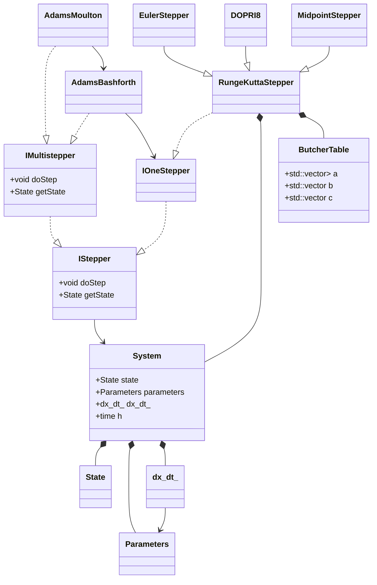

```mermaid
classDiagram
    class State
    class Parameters
    class dx_dt_

    dx_dt_ --> Parameters

    class System {
        +State state
        +Parameters parameters
        +dx_dt_ dx_dt_
        +time h
    }

    System *-- State
    System *-- Parameters
    System *-- dx_dt_

    class IStepper{
        +void doStep
        +State getState
    }

    IStepper --> System

    RungeKuttaStepper ..|> IOneStepper
    RungeKuttaStepper *-- System
    RungeKuttaStepper *-- ButcherTable

    class ButcherTable{
        +std::vector<std::vector<double>> a
        +std::vector<double> b
        +std::vector<double> c
    }

    EulerStepper --|> RungeKuttaStepper
    DOPRI8 --|> RungeKuttaStepper
    MidpointStepper --|> RungeKuttaStepper

    class IMultistepper{
        +void doStep
        +State getState
    }

    IMultistepper ..|> IStepper

    AdamsBashforth ..|> IMultistepper

    AdamsMoulton ..|> IMultistepper
    AdamsMoulton --> AdamsBashforth

    AdamsBashforth --> IOneStepper
    IOneStepper ..|> IStepper


```
